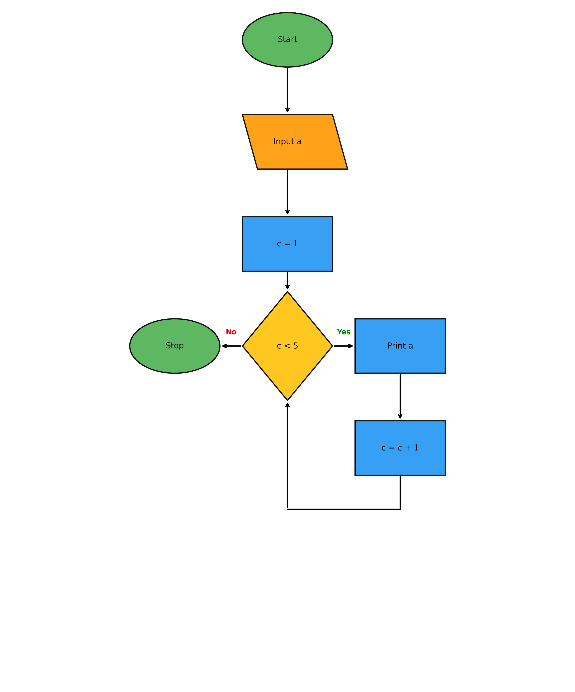

# Code to Flowchart

Hey there! 👋 Welcome to **Code to Flowchart** , this is a Python tool that turns your code into the easy-to-understand flowcharts. Whether you're trying to explain your algorithm to teammates, document your code, or just visualise your logic, this tool has got you covered!

## 📊 From Code to Visual in Seconds

**Here's a simple Python example:**

```python
def calculate_sum(n):
    """Calculate the sum of numbers from 1 to n."""
    total = 0
    i = 1

    while i <= n:
        total += i
        i += 1

    return total

def main():
    number = int(input("Enter a number: "))

    result = calculate_sum(number)

    # Display the result
    print(f"The sum of numbers from 1 to {number} is: {result}")
```

**And here's the flowchart it generates:**




## ✨ What's Cool About This Tool

- **Simple to use** - Just point it at your Python file and watch the magic happen
- **Grid-based layout** - Everything is aligned for that professional look
- **Smart shape sizing** - Automatically adjusts shape sizes based on flowchart complexity
- **Color schemes** - Choose from standard, pastel, monochrome, or colorful themes
- - **Multiple output formats** - Save as PNG, SVG, or PDF

## 🚀 Getting Started

### Installation

1. Clone this repo to your machine:
   ```bash
   git clone https://github.com/yourusername/co_to_f.git
   cd co_to_f
   ```

2. Install the dependencies:
   ```bash
   pip install -r requirements.txt
   ```

3. Make it executable (optional but handy):
   ```bash
   chmod +x co_to_f
   ```

### Quick Start

The simplest way to use it:

```bash
./co_to_f your_python_file.py
```

That's it! You'll get a nice flowchart saved as a PNG file.

## 🎮 How to Use It

### Basic Command

```bash
python simple_flowchart.py
```

This generates a simple example flowchart with the default settings.

### Command Options

You can customise your flowcharts with these options:

```bash
python simple_flowchart.py -o my_flowchart.png -c colorful --show
```

- `-o, --output`: Where to save your flowchart
- `-f, --format`: Choose format (png, svg, pdf)
- `-c, --color-scheme`: Pick a color scheme (standard, pastel, monochrome, colorful)
- `--show`: Opens the flowchart automatically when done

## 🎨 Color Schemes

- **standard**: Professional blue/green theme
- **pastel**: Soft, easy-on-the-eyes colors
- **monochrome**: Classic black and white
- **colorful**: Vibrant colors for presentations

## 🧠 Smart Features

### Dynamic Shape Sizing

The tool is smart enough to know when your flowchart is getting complex:

- **Simple flowcharts** (< 10 nodes): Uses larger, more readable shapes
- **Complex flowcharts** (> 10 nodes): Automatically shrinks shapes to fit everything nicely

## 📚 Creating Your Own Flowcharts

Want to create a custom flowchart? It's easy! Check out the example scripts:

1. Define your nodes (shapes) with positions on a 0-1 scale
2. Define the connections between nodes
3. Run the generator

Here's a simplified example:

```python
flowchart = {
    "nodes": [
        {"id": 0, "type": "start_end", "text": "Start", "x": 0.5, "y": 0.9},
        {"id": 1, "type": "process", "text": "Do something", "x": 0.5, "y": 0.5},
        {"id": 2, "type": "start_end", "text": "End", "x": 0.5, "y": 0.1}
    ],
    "edges": [
        {"from": 0, "to": 1, "text": ""},
        {"from": 1, "to": 2, "text": ""}
    ]
}
```

## 🤝 Contributing

I'd absolutely love your help making this tool even better! This project is all about community, and your ideas and contributions can make a huge difference.

Here's how you can join in:
- **Got an idea?** Open an issue and let's talk about it!
- **Found a bug?** Let me know so we can squash it together
- **Want to add a feature?** Submit a pull request - all contributions are welcome, big or small
- **Made something cool?** Share your flowchart creations and inspire others!

Even if you're new to open source, I'd be happy to help you get started. We were all beginners once!

## 🔮 What's Coming Next

I'm actively exploring some exciting new features:

- **Real-time output** - See your flowchart build as you type your code
- **Interactive flowcharts** - Click on nodes to see the actual code they represent
- **More programming languages** - Support for JavaScript, Java, C++, and more
- **Custom themes** - Create and share your own color schemes
- **Export to more formats** - Including Mermaid, PlantUML, and more

If any of these sound interesting or you have other ideas, come join the development!

## 📝 License

This project is licensed under the MIT License - see the LICENSE file for details.

---

Made with ❤️ for people who love clean, beautiful code visualisation. Happy flowcharting!
